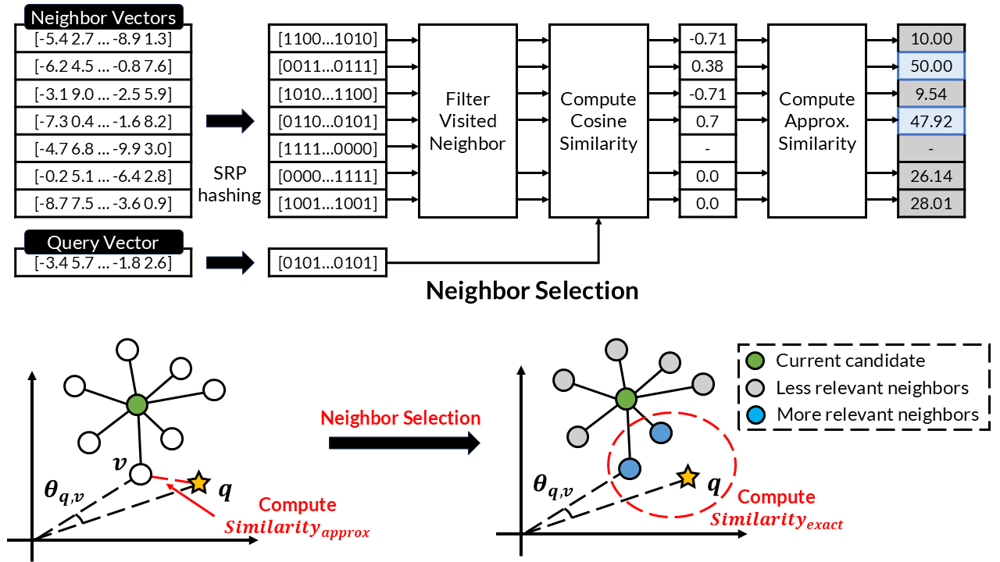

# ADA-NNS: Angular Distance-Guided Neighbor Selection for Graph-Based Approximate Nearest Neighbor Search

## Overview
ADA-NNS is a novel angular distance-guided search that dynamically filters out less relevant neighbors by employing a lightweight proxy based on a angular distance. It not only achieves the state-of-the art performance for various datasets, but also maintains good compatibility with existing indices, such as HNSW.



Please refer to the full paper ADA-NNS (To appear WWW 2025).

## Datasets

| Name     | Dimension | No. of base | No. of query | Metric |
|----------|-----------|-------------|--------------|--------|
| [SIFT1M](http://corpus-texmex.irisa.fr/)   | 128       | 1,000,000   | 10,000       | L2 |
| [GIST1M](http://corpus-texmex.irisa.fr/)   | 960       | 1,000,000   | 1,000        | L2 |
| [CRAWL](http://github.com/ZJULearning/SSG)    | 300       | 1,989,995   | 10,000       | L2 |
| [GLOVE-100](https://github.com/erikbern/ann-benchmarks)   | 100       | 1,183,514   | 10,000        | IP |
| [NYTIMES](https://github.com/erikbern/ann-benchmarks)   | 256       | 290,000   | 10,000        | IP |
| DEEP100M* | 96        | 100,000,000 | 10,000        | L2 |
+ For DEEP100M, we will share the file link upon request

## How to Use

### Initialize

1. Clone submodules:

```bash
git submodule update --init --recursive
```

2. Download datasets and store into `dataset` directory 

3. Crate a symbolic link to the `dataset` directory in submodules:
```bash
ln -s ${PWD}/dataset algorithms/hnswlib/dataset
ln -s ${PWD}/dataset algorithms/ADA-NNS/hnswlib/dataset
```

4. Reproduce WWW'2025 results

Follow Readme in each directory
+ [HNSW (baseline)](https://github.com/K16DIABLO/hnswlib/tree/v0.8.0)
+ [HNSW (ADA-NNS)](https://github.com/K16DIABLO/hnswlib/tree/ADA-NNS)
